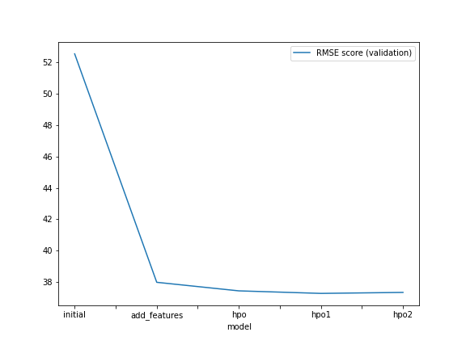
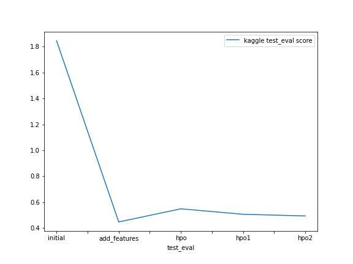

# Report: Predict Bike Sharing Demand with AutoGluon Solution
#### Chaitanya Dinkar Chaudhari

## Initial Training
### What did you realize when you tried to submit your predictions? What changes were needed to the output of the predictor to submit your results?
**Five different experiments were performed as follows:**
1. Initial Raw Submission   **[Model: `initial`]**
2. Added Features Submission *(EDA +  Feature Engineering)* **[Model: `add_features`]**
3. Hyperparameter Optimization (HPO) - Initial Setting Submission 
4. Hyperparameter Optimization (HPO) - Setting 1 Submission 
5. Hyperparameter Optimization (HPO) - Setting 2 Submission **[Model: `hpo (top-hpo-model: hpo2)`]**

**Observation:** While submitting predictions obtained from all these five experiments, some of the experiments delivered negative predictions values. 
**Changes incorporated:** Kaggle refuses the submissions containing negative predictions values obtained from the predictor. Hence, all such negative outputs from respective predictors were replaced with 0. 

### What was the top ranked model that performed?
The `top-ranked model` was the `(add features) model` named `WeightedEnsemble_L3`, with a **validation RMSE score** of **37.9800** and the best **Kaggle score** of **0.44798 (on test dataset)**. This model was developed by training on data obtained using exploratory data analysis (EDA) and feature engineering without the use of a hyperparameter optimization routine. Upon hyperparameter-optimization, some models did show improved RMSE scores on validation data; however this model delivered the best performance on unseen test dataset. Note that many models delivered competitive performance, hence the selection was done considering both RMSE (cross-validation) and Kaggle (test data) scores respectively.

*Note: The autogluon package considers the RMSE scores in the jupyter notebook to be negative in order to rank them in terms of highest scores, and it further expects them to be multiplied by a factor of '-1' in order to produce the accurate RMSE scores.  Since autogluon follows this routine, values in the jupyter notebook may appear as negative RMSE values.*

## Exploratory data analysis and feature creation
### What did the exploratory analysis find and how did you add additional features?
- Feature `datetime` was parsed as a datetime feature to obtain hour information from timestamp
- Independent features `season` and `weather` were initially read as `integer`. Since these are categorical variables, they were transformed into `category` data type.
- The data for `year`, `month`, `day` *(dayofweek)* and `hour` were extracted as distinct independent features from the `datetime` feature using feature extraction. Upon feature extraction, `datetime` feature was dropped. 
- After probing and considering the features, `casual` and `registered`, it was noticed that the RMSE scores improved significantly during cross-validation and these independent features were highly co-related to the target variable `count`. However, the features `casual` and `registered` are only present in the train dataset and absent in the test data; hence, these features were ignored/dropped during model training
- Another categorical feature `day_type` was added based on `holiday` and `workingday` feature. It was defined to effectively segregate "weekday", "weekend" and "holiday" categories.
- Moreover, features `temp` (temperature in degree Celsius) and `atemp` (*'feels like'* temperature in degree Celsius) had a `high positive correlation of 0.98`. Hence, in order to reduce multicollinearity between independent variables, `atemp` was dropped from the train and test datasets respectively.
- Further, data visualization was conducted to derive insights from the features.

### How much better did your model perform after adding additional features and why do you think that is?
- The addition of additional features `improved model performance by approximately 138%` in comparison to the initial/raw model (without EDA and/or feature engineering) performance.
- The model performance improved after converting certain categorical variables with `integer` data types into their true `categorical` datatypes. 
- In addition to ignoring `casual` and `registered` features during model training, even `atemp` was dropped from the datasets, as it was highly correlated to another independent variable `temp`. This assisted in reducing multicollinearity.
- Moreover, splitting the `datetime` feature into multiple independent features such as `year`, `month`, `day` and `hour` along with the addition of `day_type`, further improved the model performance because these predictor variables `aid the model assess seasonality or historical patterns in the data` more effectively. 

## Hyperparameter tuning
### How much better did your model preform after trying different hyper parameters?
Hyperparameter tuning was beneficial because it enhanced the model's performance compared to the initial submission. Three different configurations were used while performing hyperparameter optimization experiments. Although hyperparameter tuned models delivered competitive performances in comparison to the model with EDA and added features, the latter performed exceptionally better on the Kaggle (test) dataset. 

**Observations:**
- The prescribed settings were taken into account while using the autogluon package for training. However, the performances of hyperparameter optimized models were sub-optimal because the hyperparameters are tuned with a fixed set of values given by the user, which limit the options autogluon could explore. 
- Moreover, while performing hyperparameter optimization using autogluon, the 'time_limit' and 'presets' parameters are quite crucial. 
- Autogluon may fail to build any models for a prescribed set of hyperparameters to be tuned, if the time limit is too less for the models to be built. 
- Also, hyperparameter optimization with presets like "high_quality" (with auto_stack enabled) require high memory usage and are computationally intensive for the prescribed time limit using available resources. Hence, lighter and faster preset options like 'medium_quality' and 'optimized_for_deployment' were experimented with. I preferred faster and lighter preset, "optimize_for_deployment" for hyperparameter optimization routine, as the rest failed to create models using AutoGluon for the experimental configurations.
- `Exploration vs exploitation` is the biggest challenge while using AutoGluon with a prescribed range of hyperparameters.

### If you were given more time with this dataset, where do you think you would spend more time?
Given more time to work with this dataset, I would like to investigate additional potential outcomes when AutoGluon is run for an extended period with a high quality preset and enhanced hyperparameter tuning.

### Create a table with the models you ran, the hyperparameters modified, and the kaggle score.
|model|hpo1|hpo2|hpo3|score|
|--|--|--|--|--|
|initial|prescribed_values|prescribed_values|"presets: 'high quality' (auto_stack=True)"|1.84484|
|add_features|prescribed_values|prescribed_values|"presets: 'high quality' (auto_stack=True)"|0.44798|
|hpo (top-hpo-model: hpo2)|Tree-Based Models: (GBM, XT, XGB & RF)|KNN|"presets: 'optimize_for_deployment"|0.49440|

### Create a line plot showing the top model score for the three (or more) training runs during the project.

### Create a line plot showing the top kaggle score for the three (or more) prediction submissions during the project.

## Summary
- The AutoGluon AutoML framework for Tabular Data was thoroughly studied and incorporated into this bike sharing demand prediction project. 
- The AutoGluon framework's capabilities were fully utilized to make automated stack ensembled as well as individually distinct configured regression models trained on tabular data. It assisted in quickly prototyping a base-line model. 
- The top-ranked AutoGluon-based model improved results significantly by utilizing data obtained after extensive exploratory data analysis (EDA) and feature engineering without hyperparameter optimization.
- Leveraging automatic hyperparameter tuning, model selection/ensembling and architecture search allowed AutGluon to explore and exploit the best possible options. 
- Addtionally, hyperparameter tuning using AutoGluon also offered improved performance over the initial raw submission; but it wasn't better than that of the model with EDA, feature engineering and no hyperparameter tuning.  
- It was noticed that hyperparameter-tuning using AutoGluon (without default hyperparameters or random configuration of parameters) is a cumbersome process, and is highly dependent on the time limit, prescribed presets, possible family of models and range of hyperparameters to be tuned.
